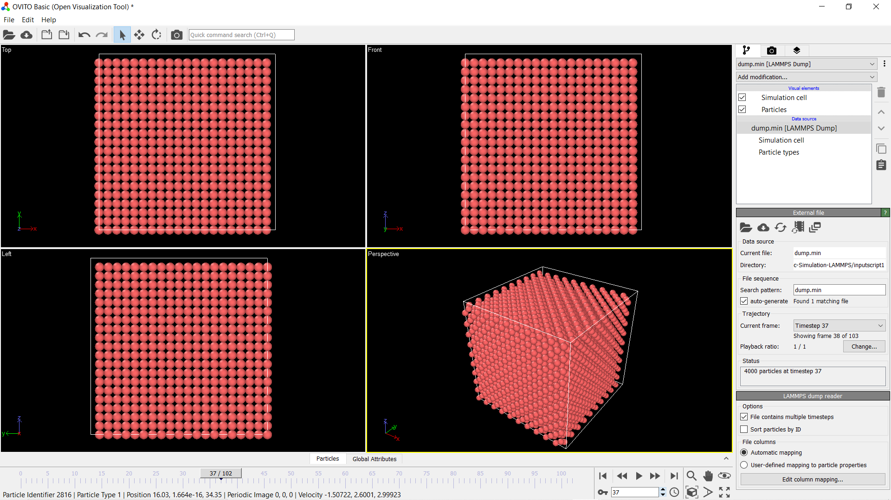

# Molecular-Dynamic-Simulation-LAMMPS

Performed simulation of Argon particles in FCC arrangement using LAMMPS(Large-scale Atomic/Molecular Massively Parallel Simulator). While preparing the input scripts, experimented with various inter-atomic potentials such as Lennard-Jone potential. Also, applied multiple operations on the system and visualized it using OVITO. 

### Programs/Tools Used:

* Simulation Program Used: LAMMPS(25 January 2020 Stable Release)  
* Visualization Tool Used: OVITO(Release 3.3.1)

### Visualization:

The image below depicts the standard visualization interface in OVITO. The visualization below was conducted for the NO FIX case, in this case the atoms did not move. The dump files for all the cases are there in their respective folders. 

